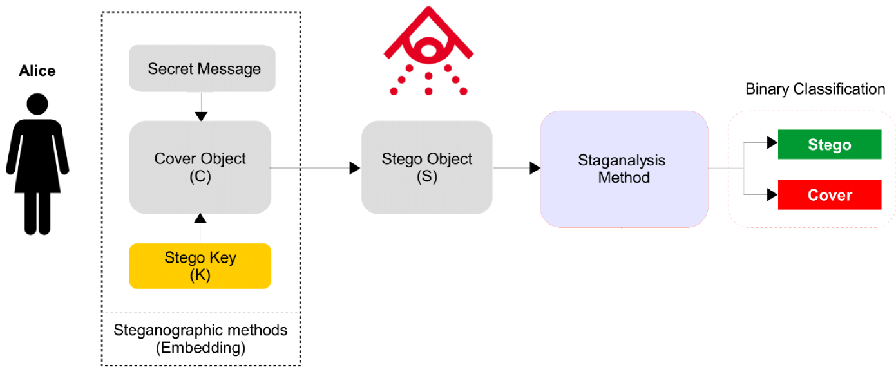
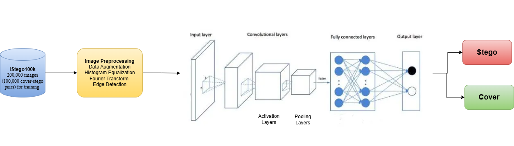

# Image Steganalysis: In Search for the Invisible
## Introduction 
This repository provides the source code and raw datasets associated with the study of Image Steganalysis.

As digital communication and multimedia technologies evolve, ensuring the security of information becomes increasingly critical. Images often transmitted online are vulnerable to unauthorized modifications and security threats. One such threat is steganography, a technique used to hide secret information within digital images in a way that is imperceptible to the human eye. While it can be used for secure communication, it can also be exploited for malicious purposes, such as hiding illegal content or spreading harmful information.

Steganalysis is the process of detecting hidden messages in digital images that have been concealed using steganography. It involves analyzing images for suspicious patterns or features to uncover concealed information and mitigate the risks posed by the malicious use of steganography.



The objective of this study was to detect transform-domain stego images using a deep learning pipeline based on transfer learning. EfficientNetB3 was selected as the backbone architecture, motivated by prior work that reported strong performance on the ALASKA2 dataset. The overall workflow of the proposed method is depicted below. To enhance the stego signal, two types of image preprocessing techniques were applied: high-pass filtering and Gabor filtering. These techniques helped to emphasize subtle modifications introduced during steganographic embedding before the images were passed to the classification model. The overall project workflow is depicted below.



EfficientNetB3 was used as the primary backbone due to its favorable accuracy-to-parameter ratio. It uses compound scaling to adjust depth, width, and resolution in a coordinated manner which maximizes efficiency. The model was initialized with pretrained weights from ImageNet and fine-tuned for binary classification by replacing the final classification head with a fully connected layer producing two output logits.

To evaluate the effect of different architectures on steganalysis performance, experiments were also conducted using VGG19, ResNet101, and BayarConvNet. VGG19 and ResNet101 are well-established convolutional neural networks known for their strong performance in image classification tasks. BayarConvNet, originally proposed for steganalysis, utilizes constrained convolutional kernels to better capture stego-specific noise patterns.

## Data
Two large-scale benchmark datasets were used in this study:
### 1. IStego100K: 
IStego100K is a large-scale image steganalysis dataset comprising 208,104 JPEG images, all with a resolution of 1024×1024 pixels. It includes 100,000 cover-stego image pairs (200,000 images) used for training and 8,104 images reserved for testing. Each stego image is generated using one of three well-known transform-domain steganographic algorithms: J-UNIWARD, nsF5, or UERD. These are transform-domain embedding methods (i.e., the hidden message is embedded in the DCT coefficients of JPEG images), which makes stego signals more difficult to detect using pixel-domain features. For each image, the stego algorithm is randomly selected, the embedding rate is randomly sampled from a range of 0.1 to 0.4 bits per non-zero AC DCT coefficient, and the JPEG quality factor is randomly chosen between 75 and 95. This variability makes the dataset realistic and challenging for learning generalizable steganalysis features.

### 2. ALASKA2:
ALASKA2 is a public dataset released as part of the ALASKA2 steganalysis competition hosted on Kaggle. It contains 300,000 JPEG images of size 512×512, split equally between cover images and stego images. Stego images are generated using three modern transform-domain steganographic algorithms: JMiPOD, J-UNIWARD, and UERD. The dataset structure is as follows:

1. **Cover**: 75,000 original JPEG images without any hidden data.
2. **JMiPOD**: 75,000 stego images produced using the JMiPOD algorithm.
3. **J-UNIWARD**: 75,000 stego images generated using the J-UNIWARD algorithm.
4. **UERD**: 75,000 stego images created using the UERD algorithm.

Unlike IStego100K, the exact payload for each image is not explicitly provided. Instead, the embedding process dynamically adjusts the payload to maintain a consistent detection difficulty. For example, complex or textured regions may carry higher payloads, while smoother regions embed less. The average payload is approximately 0.4 bits per non-zero AC DCT coefficient. JPEG compression quality factors used in the dataset are 75, 90, and 95. Each embedding algorithm is used with approximately equal probability.

## Installation 
### 1. Clone the repo 
```bash
git clone https://github.com/HardiMatholia/Image_Steganalysis.git
```
### 2. Change directory
```bash
cd Image_Steganalysis
```


# 🧠 Training and Evaluation Instructions

## 📁 File Naming Convention
- Code files follow the naming convention:  
  **`<ArchitectureName>Main<DatasetName>.py`**
  
- **Example**:  
  For training EfficientNetB3 on the IStego100k dataset, the script will be:  
  `EfficientNetB3MainIStego.py`

---

## 🔧 Setup Instructions

1. **Update Dataset Paths**  
   - Modify the paths to the **stego**, **cover**, and **test** directories in the script to match the dataset locations on your machine.

2. **Install Dependencies**  
   - Make sure all required Python packages are installed:  
     ```bash
     pip install -r requirements.txt
     ```
     (Or install them individually if a `requirements.txt` is not provided.)

3. **Run the Script**  
   - Execute the corresponding Python file:  
     ```bash
     python EfficientNetB3MainIStego.py
     ```

---

## 📊 What You Will See

- Training and validation **loss/accuracy** for each epoch.
- Final **Test Accuracy** and **AUC Score** at the end of training, which help evaluate model performance.

---

✅ *Happy Training!* 😊  

 


