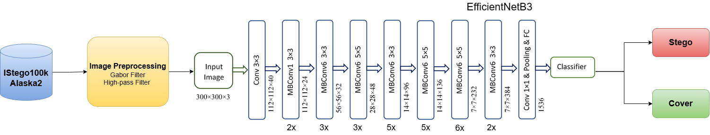

# 🖼️ Image Steganalysis: In Search for the Invisible

## 🚀 Introduction

This repository provides the source code and raw datasets associated with the study of Image Steganalysis.

As digital communication and multimedia technologies evolve, ensuring the security of information becomes increasingly critical. Images often transmitted online are vulnerable to unauthorized modifications and security threats. One such threat is **steganography**, a technique used to hide secret information within digital images in a way that is imperceptible to the human eye. While it can be used for secure communication, it can also be exploited for malicious purposes.

**Steganalysis** is the process of detecting hidden messages in digital images that have been concealed using steganography. It involves analyzing images for suspicious patterns or features to uncover concealed information and mitigate the risks posed by the malicious use of steganography.


The objective of this study was to detect transform-domain stego images using a deep learning pipeline based on **transfer learning**. EfficientNetB3 was selected as the backbone architecture, motivated by prior work that reported strong performance on the ALASKA2 dataset. To enhance the stego signal, two types of image preprocessing techniques were applied: **high-pass filtering** and **Gabor filtering**. These techniques emphasize subtle modifications introduced during steganographic embedding before the images are passed to the classification model.



EfficientNetB3 was used as the primary backbone due to its favorable accuracy-to-parameter ratio. It uses compound scaling to adjust depth, width, and resolution in a coordinated manner. The model was initialized with pretrained weights from ImageNet and fine-tuned for binary classification by replacing the final classification head.

To evaluate the effect of different architectures, experiments were also conducted using **VGG19**, **ResNet101**, and **BayarConvNet**.

---

## 📊 Datasets

### 1. IStego100K

IStego100K is a large-scale image steganalysis dataset comprising **208,104 JPEG images** (1024×1024 resolution). It includes:

- 100,000 cover-stego pairs (200,000 images) for training
- 8,104 images for testing

Stego algorithms used:
- J-UNIWARD
- nsF5
- UERD

Each image is embedded with a payload (0.1–0.4 bits/non-zero AC DCT coefficient), and JPEG quality factors vary between 75 and 95.

### 2. ALASKA2

ALASKA2 contains **300,000 JPEG images** (512×512 resolution), equally split:

- 75,000 Cover images
- 75,000 JMiPOD stego images
- 75,000 J-UNIWARD stego images
- 75,000 UERD stego images

Payloads are dynamically adjusted per image, with JPEG quality factors of 75, 90, and 95.

---

## 🛠️ Installation

### 1. Clone the Repository

```bash
git clone https://github.com/HardiMatholia/Image_Steganalysis.git
```
### 2. Change directory
```bash
cd Image_Steganalysis
```

---

## 🧠 Training and Evaluation Instructions

### 📁 File Naming Convention
- Code files follow the naming convention:  
  **`<ArchitectureName>Main<DatasetName>.py`**
  
- **Example**:  
  For training EfficientNetB3 on the IStego100k dataset, the script will be:  
  `EfficientNetB3MainIStego.py`

---

### 🔧 Setup Instructions

1. **Update Dataset Paths**  
   - Modify the paths to the **stego**, **cover**, and **test** directories in the script to match the dataset locations on your machine.

2. **Install Dependencies**  
   - Make sure all required Python packages are installed 

3. **Run the Script**  
   - Execute the corresponding Python file:  
     ```bash
     python EfficientNetB3MainIStego.py
     ```

---

### 📊 What You Will See

- Training and validation **loss/accuracy** for each epoch.
- Final **Test Accuracy** and **AUC Score** at the end of training, which help evaluate model performance.

---

✅ *Happy Training!* 😊  

 


